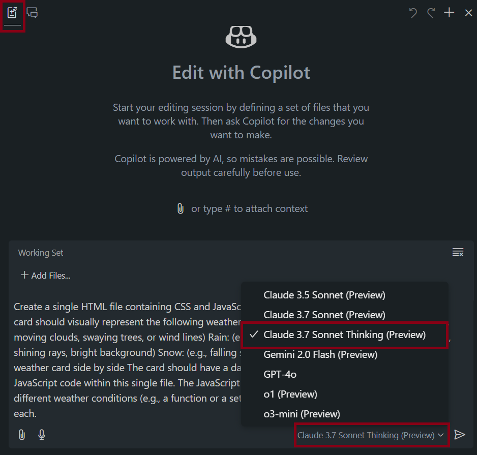
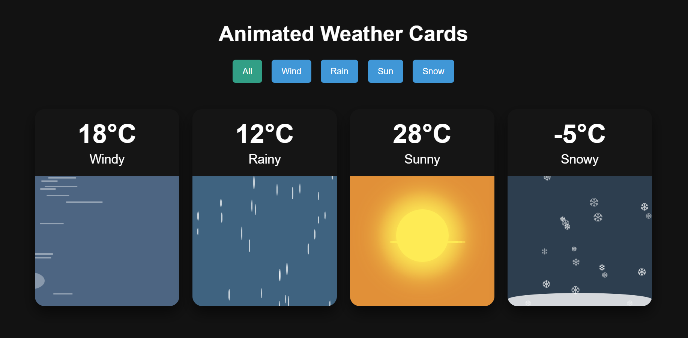

# One-Shot Prompt engineering with Claude 3.7

This is a one-shot prompt engineering experiment with Claude 3.7. The goal is to create a single page with animation using Claude 3.7 Model, use the following instructions to generate the code.

1. Update your Coplito chat to Edit with Copilot
2. Set Claude to 3.7 Sonnet Thinking as model

    

3. Enter the following

    <pre style="white-space: pre-wrap; word-wrap: break-word;">Create a single HTML file containing CSS and JavaScript to generate an animated weather card. The card should visually represent the following weather conditions with distinct animations:
    • Wind: (e.g., moving clouds, swaying trees, or wind lines)
    • Rain: (e.g., falling raindrops, puddles forming)
    • Sun: (e.g., shining rays, bright background)
    • Snow: (e.g., falling snowflakes, snow accumulating)
    Show all the weather cards side by side. The card should have a dark background. Provide all the HTML, CSS, and JavaScript code within this single file. The JavaScript should include a way to switch between the different weather conditions (e.g., a function or a set of buttons) to demonstrate the animations for each.
    </pre>

4. Accept the copilot suggestions and generate the code
5. Open the HTML on your borwser and see the animation

    

ps. The code generated by Copilot is not perfect, you may need to tweak it to make it work as expected.

You can use the file <a href=result/weather-cards.html>/result/weather-cards.html</a> to see the final result.
