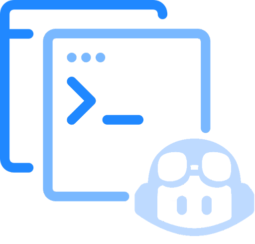

<!-- markdownlint-disable MD024 -->
<!-- markdownlint-disable MD045 -->

# Copilot Demos Repository

<p style="margin-left: 30px;">

This repository includes Copilot training exercises intended to give you practical experience using
 +

</p>

## 🎯 Goal

Learn of how to use prompt engineering techniques to get accurate responses from
 +


---

### Prompting Best Practices

- Provide references
  - Improve relevance of the response by providing an example and context
- Write clear instruction
  - Refine your prompt, provide context, write clearly, and give Copilot ample input for better results
- Split up big tasks
  - Breaking down complex tasks minimizes errors and utilizes previous outcomes for efficiency
- Allow GitHub Copilot time to think
  - Requesting Copilot’s thought process will enhance Copilot accuracy, but it may prolong wait times.
- Test changes systematically
  - Measure performance, watch for prompt changes' side effects, and use test suites for implementation

### Cornerstones of Prompting

- Context :: Provide Examples
  - Information to help GitHub Copilot understand the task better
- Intent :: Give Directions
  - The specific goal or purpose you have in mind when creating a prompt
- Clarity :: Easy to Understand
  - Being clear, transparent, and easily understood
- Specificity :: Precision in Detail
  - Providing precise and detailed information, leaving little room for ambiguity or interpretation

---

## ✍️ Programming Languages

**Javascript**
**C#**
**Python**
**Java**

---

## 💻 IDE

-  VS Code
-  Visual Studio
-  JetBrains IDE

---

## 🗒️ Guide

### Prerequisites

- Copilot
- Copilot Chat
- GitHub Account

---

### DEMO 1

#### Copilot prompt engineering

```text
This demo focuses on the basics of prompt engineering. You will learn how to provide context, write clear instructions, and split up big tasks to get accurate responses from Copilot.
```

Navigate to <a href=copilot-prompt-engineering/README.md> copilot-prompt-engineering.

#### Good Luck

## 🤝 Contributing

Contributions are warmly welcomed! ✨
